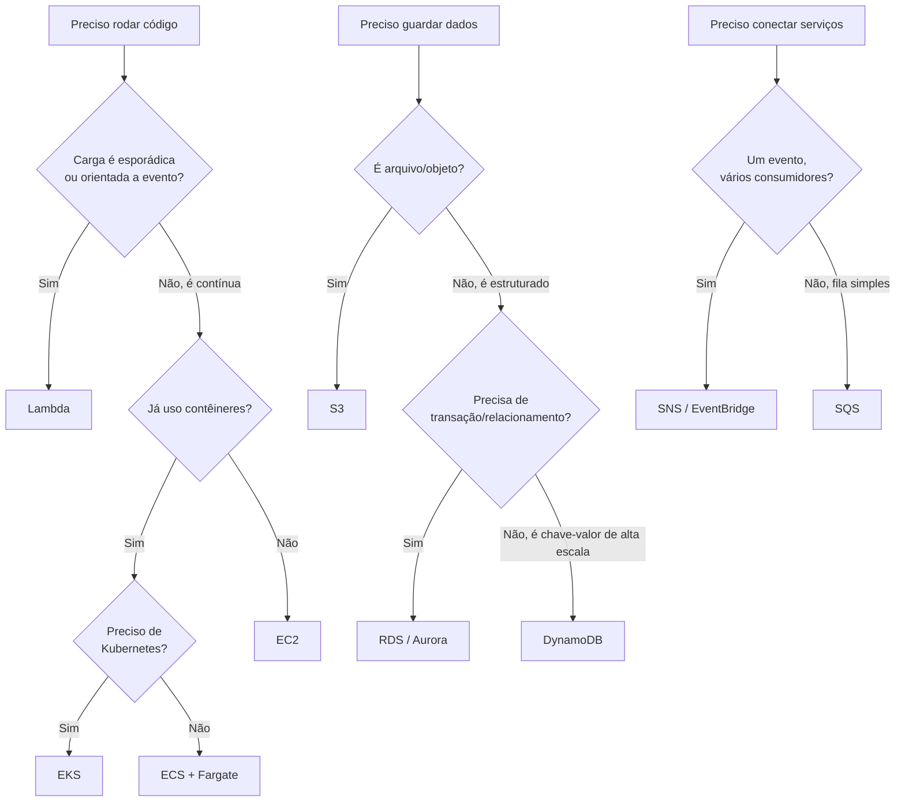

# ☁️ Arquitetando AWS — Guia dos Principais Serviços

Guia de referência pelos principais serviços da AWS, organizado por categoria: **o que cada um faz, quando usar, e com o que ele compete dentro da própria AWS.** O objetivo é servir como mapa mental para decisões de arquitetura — não uma lista de features, mas um guia de "qual serviço resolve qual problema".

## 📋 Sumário

- [1. Computação](#1-computação)
- [2. Armazenamento](#2-armazenamento)
- [3. Banco de dados](#3-banco-de-dados)
- [4. Redes e entrega de conteúdo](#4-redes-e-entrega-de-conteúdo)
- [5. Mensageria e integração](#5-mensageria-e-integração)
- [6. Segurança e identidade](#6-segurança-e-identidade)
- [7. Dados e analytics](#7-dados-e-analytics)
- [8. IA e Machine Learning](#8-ia-e-machine-learning)
- [9. DevOps e infraestrutura como código](#9-devops-e-infraestrutura-como-código)
- [10. Observabilidade](#10-observabilidade)
- [11. Árvore de decisão: qual serviço usar?](#11-árvore-de-decisão-qual-serviço-usar)

---

## 1. Computação

| Serviço | O que é | Quando usar |
|---|---|---|
| **EC2** | Máquinas virtuais (IaaS) | Controle total do SO, cargas legadas, workloads que precisam de configuração customizada |
| **Lambda** | Funções serverless, cobrança por execução | Processamento sob demanda, APIs leves, automações event-driven, picos irregulares de uso |
| **ECS** | Orquestração de contêineres (integrado ao ecossistema AWS) | Times já usando Docker, querem menos complexidade que Kubernetes |
| **EKS** | Kubernetes gerenciado | Times que já usam Kubernetes ou precisam de portabilidade multi-cloud |
| **Fargate** | Motor serverless para ECS/EKS (sem gerenciar servidores) | Contêineres sem se preocupar com provisionamento de instância |
| **Elastic Beanstalk** | PaaS — sobe a aplicação, a AWS cuida do resto | Times pequenos, deploy rápido sem lidar com infraestrutura |

**Regra prática:** comece por Lambda se a carga for esporádica/event-driven; vá para ECS/Fargate se precisar de processos de longa duração ou mais controle; só use EC2 puro se precisar de acesso total ao SO.

## 2. Armazenamento

| Serviço | O que é | Quando usar |
|---|---|---|
| **S3** | Armazenamento de objetos (arquivos, imagens, backups, data lake) | Praticamente qualquer arquivo estático — de sites a datasets inteiros |
| **EBS** | Disco de bloco anexado a uma instância EC2 | Armazenamento persistente para uma VM específica (ex: banco de dados rodando em EC2) |
| **EFS** | Sistema de arquivos compartilhado entre múltiplas instâncias | Quando várias instâncias/contêineres precisam ler/escrever no mesmo filesystem |
| **Glacier** | Armazenamento "frio", ultra barato, para dados raramente acessados | Backups de longuíssimo prazo, arquivamento regulatório |

**Regra prática:** S3 é o padrão-ouro pra 90% dos casos. EBS só quando o disco pertence a uma única instância. EFS quando precisa de compartilhamento simultâneo.

## 3. Banco de dados

| Serviço | O que é | Quando usar |
|---|---|---|
| **RDS** | Banco relacional gerenciado (Postgres, MySQL, SQL Server etc.) | Dados transacionais, schema bem definido, necessidade de consistência forte |
| **Aurora** | Banco relacional proprietário da AWS, compatível com MySQL/Postgres | Mesma coisa que RDS, mas com mais performance/escala — custo maior |
| **DynamoDB** | NoSQL gerenciado, chave-valor/documento | Alta escala de leitura/escrita, schema flexível, baixa latência previsível |
| **ElastiCache** | Cache em memória (Redis/Memcached) gerenciado | Reduzir carga em bancos, sessões de usuário, filas simples |
| **Redshift** | Data warehouse colunar | Analytics/BI sobre grandes volumes de dados históricos |

**Regra prática:** se os dados têm relações claras e precisam de transações ACID → RDS/Aurora. Se o padrão de acesso é simples (buscar por chave) e a escala é grande → DynamoDB. Se é para relatórios/BI → Redshift.

## 4. Redes e entrega de conteúdo

| Serviço | O que é | Quando usar |
|---|---|---|
| **VPC** | Rede virtual isolada dentro da AWS | Base de qualquer arquitetura — isolamento e controle de tráfego |
| **CloudFront** | CDN global | Servir conteúdo estático (e até dinâmico) com baixa latência mundial — essencial para streaming, como no case study do Spotify |
| **Route 53** | DNS gerenciado | Resolução de domínio, roteamento por latência/geolocalização, failover |
| **API Gateway** | Porta de entrada gerenciada para APIs (REST/WebSocket) | Expor Lambdas ou serviços como API pública, com throttling, auth e cache embutidos |
| **Elastic Load Balancer (ALB/NLB)** | Balanceamento de carga | Distribuir tráfego entre múltiplas instâncias/contêineres |

## 5. Mensageria e integração

| Serviço | O que é | Quando usar |
|---|---|---|
| **SQS** | Fila de mensagens gerenciada | Desacoplar serviços, processar tarefas assíncronas de forma confiável |
| **SNS** | Pub/Sub — notificações para múltiplos assinantes | Broadcast de eventos para vários consumidores (email, SMS, Lambda, SQS) |
| **EventBridge** | Barramento de eventos entre serviços AWS e de terceiros | Arquiteturas orientadas a eventos mais sofisticadas, com roteamento por regras |
| **Kinesis** | Streaming de dados em tempo real, alta taxa de ingestão | Telemetria, logs, eventos de cliques — o equivalente AWS ao Kafka |

**Regra prática:** SQS para "um produtor, um consumidor processa depois". SNS/EventBridge para "um evento, vários interessados". Kinesis quando o volume é massivo e contínuo (streaming de verdade).

## 6. Segurança e identidade

| Serviço | O que é | Quando usar |
|---|---|---|
| **IAM** | Controle de identidade e permissões | Base de tudo — quem pode fazer o quê em cada recurso |
| **Cognito** | Autenticação/autorização de usuários finais (não da infraestrutura) | Login de usuários em apps web/mobile, com suporte a social login |
| **KMS** | Gerenciamento de chaves de criptografia | Criptografar dados sensíveis em repouso (S3, RDS, EBS) |
| **Secrets Manager** | Armazenamento seguro de credenciais/segredos | Substituir segredos hardcoded (ex: connection strings, API keys) |
| **WAF** | Firewall de aplicação web | Proteger APIs/sites contra ataques comuns (SQL injection, XSS, bots) |

## 7. Dados e analytics

| Serviço | O que é | Quando usar |
|---|---|---|
| **Athena** | Consulta SQL direto sobre arquivos no S3 | Análises pontuais sem precisar carregar dados em um banco |
| **Glue** | ETL gerenciado (catalogação e transformação de dados) | Pipelines de dados entre fontes heterogêneas |
| **EMR** | Big data gerenciado (Spark, Hadoop) | Processamento distribuído de grandes volumes — equivalente ao Databricks no ecossistema AWS |
| **QuickSight** | BI/visualização de dados | Dashboards para o negócio, sem precisar de ferramenta externa |

## 8. IA e Machine Learning

| Serviço | O que é | Quando usar |
|---|---|---|
| **Bedrock** | Acesso gerenciado a LLMs de terceiros (Claude, Titan etc.) via API | Integrar IA generativa em produtos sem treinar modelo próprio |
| **SageMaker** | Plataforma completa de ML (treino, deploy, monitoramento) | Times de data science construindo modelos customizados do zero |
| **Rekognition** | Visão computacional pronta (reconhecimento de imagem/vídeo) | Casos de uso comuns de visão sem precisar treinar modelo |
| **Comprehend** | NLP pronto (sentimento, entidades, idioma) | Análise de texto sem pipeline de ML próprio |

## 9. DevOps e infraestrutura como código

| Serviço | O que é | Quando usar |
|---|---|---|
| **CloudFormation** | IaC nativo da AWS (JSON/YAML) | Provisionar infraestrutura de forma declarativa e versionada |
| **CDK** | IaC usando linguagens de programação (TypeScript, Python, C# etc.) | Mesma coisa que CloudFormation, mas escrevendo em código real em vez de YAML |
| **CodePipeline / CodeBuild** | CI/CD nativo da AWS | Pipelines de build/deploy sem sair do ecossistema AWS |
| **Terraform** *(não é AWS, mas citado por ser o padrão de mercado)* | IaC multi-cloud | Quando a infraestrutura pode rodar em mais de um provedor de nuvem |

## 10. Observabilidade

| Serviço | O que é | Quando usar |
|---|---|---|
| **CloudWatch** | Métricas, logs e alarmes | Monitoramento padrão de qualquer recurso AWS |
| **X-Ray** | Tracing distribuído | Rastrear uma requisição através de múltiplos microsserviços |
| **CloudTrail** | Log de auditoria de todas as chamadas de API da conta | Compliance, investigação de incidentes, "quem fez o quê" |

## 11. Árvore de decisão: qual serviço usar?

---

## 📌 Sobre este guia

Este documento não cobre todos os serviços da AWS (são centenas) — foca nos que aparecem com mais frequência em decisões reais de arquitetura, organizados pelo problema que resolvem, não pelo nome do produto. A ideia é ser um ponto de partida rápido para escolher o serviço certo antes de mergulhar na documentação oficial.

---

© 2026 Gabriel Teramae Chan
