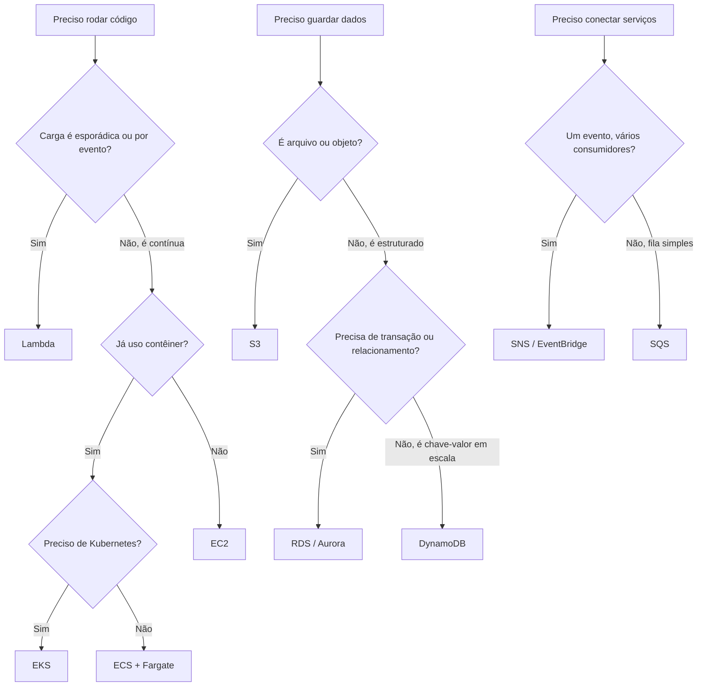

# Arquitetando AWS — mapa dos serviços principais


Guia de referência, não uma aplicação. O texto diz o que cada serviço faz, quando entra numa decisão de arquitetura e com o que ele compete dentro da AWS. Não cobre o catálogo inteiro.

## Stack

Não há SDK, template nem conta para subir. Os grupos do texto:

- Computação: EC2, Lambda, ECS, EKS, Fargate, Elastic Beanstalk
- Armazenamento: S3, EBS, EFS, Glacier
- Banco: RDS, Aurora, DynamoDB, ElastiCache, Redshift
- Rede: VPC, CloudFront, Route 53, API Gateway, ELB (ALB/NLB)
- Mensageria: SQS, SNS, EventBridge, Kinesis
- Identidade: IAM, Cognito, KMS, Secrets Manager, WAF
- Dados: Athena, Glue, EMR, QuickSight
- ML: Bedrock, SageMaker, Rekognition, Comprehend
- Entrega: CloudFormation, CDK, CodePipeline, CodeBuild. Terraform aparece só como ferramenta de mercado, não é serviço AWS
- Observabilidade: CloudWatch, X-Ray, CloudTrail

## Estrutura

Só este `README.md` e um `.gitignore`. As notas são as seções abaixo, nesta ordem:

1. Computação
2. Armazenamento
3. Banco de dados
4. Redes e entrega de conteúdo
5. Mensageria e integração
6. Segurança e identidade
7. Dados e analytics
8. IA e machine learning
9. DevOps e infraestrutura como código
10. Observabilidade
11. Árvore de decisão

## Como ler

```bash
git clone https://github.com/gabrielteramae/arquitetando-aws.git
cd arquitetando-aws
```

Leia da seção 1 até a 10 quando precisar escolher um serviço. A seção 11 é o atalho (código, dados, integração). Não há servidor neste repositório.

## 1. Computação

| Serviço | O que é | Quando usar |
|---|---|---|
| EC2 | Máquinas virtuais (IaaS) | Controle total do SO, cargas legadas, workload com configuração customizada |
| Lambda | Funções serverless, cobrança por execução | Processamento sob demanda, APIs leves, automação por evento, pico irregular |
| ECS | Orquestração de contêineres no ecossistema AWS | Time que já usa Docker e quer menos peça que Kubernetes |
| EKS | Kubernetes gerenciado | Time que já usa Kubernetes ou precisa de portabilidade |
| Fargate | Motor serverless para ECS/EKS | Contêiner sem provisionar instância |
| Elastic Beanstalk | PaaS | Deploy rápido sem operar a infraestrutura |

Regra do texto: Lambda se a carga for esporádica ou por evento; ECS/Fargate se o processo for longo ou pedir mais controle; EC2 se precisar do SO.

## 2. Armazenamento

| Serviço | O que é | Quando usar |
|---|---|---|
| S3 | Objeto (arquivo, imagem, backup, data lake) | Arquivo estático, de site a dataset |
| EBS | Disco de bloco preso a uma instância EC2 | Disco persistente de uma VM (por exemplo banco em EC2) |
| EFS | Filesystem compartilhado | Várias instâncias ou contêineres no mesmo filesystem |
| Glacier | Arquivo frio | Backup de longo prazo e retenção regulatória |

Regra do texto: S3 na maior parte dos casos. EBS quando o disco é de uma instância. EFS quando há escrita compartilhada.

## 3. Banco de dados

| Serviço | O que é | Quando usar |
|---|---|---|
| RDS | Relacional gerenciado (Postgres, MySQL, SQL Server e outros) | Dado transacional, schema estável, consistência forte |
| Aurora | Relacional da AWS, compatível com MySQL/Postgres | O mesmo papel do RDS, com mais escala e custo maior |
| DynamoDB | NoSQL chave-valor/documento | Muita leitura e escrita, schema flexível, latência previsível |
| ElastiCache | Cache em memória (Redis/Memcached) | Aliviar banco, sessão, fila simples |
| Redshift | Data warehouse colunar | Analytics e BI em volume histórico |

Regra do texto: relação e ACID vão para RDS/Aurora. Acesso por chave em escala vai para DynamoDB. Relatório vai para Redshift.

## 4. Redes e entrega de conteúdo

| Serviço | O que é | Quando usar |
|---|---|---|
| VPC | Rede virtual isolada | Base de isolamento e tráfego |
| CloudFront | CDN | Conteúdo estático ou dinâmico com menos latência |
| Route 53 | DNS | Domínio, roteamento por latência ou geografia, failover |
| API Gateway | Entrada HTTP/WebSocket | Expor Lambda ou outro serviço com throttle, auth e cache |
| Elastic Load Balancer (ALB/NLB) | Balanceamento | Repartir tráfego entre instâncias ou contêineres |

## 5. Mensageria e integração

| Serviço | O que é | Quando usar |
|---|---|---|
| SQS | Fila | Desacoplar serviço e processar tarefa depois |
| SNS | Pub/sub | Um evento para vários assinantes (e-mail, SMS, Lambda, SQS) |
| EventBridge | Barramento com regra | Evento entre serviços AWS e de fora, com roteamento |
| Kinesis | Stream de alta ingestão | Telemetria, log, clique. No texto, o papel do Kafka na AWS |

Regra do texto: SQS para um consumidor. SNS ou EventBridge para vários interessados. Kinesis quando o fluxo é contínuo e grande.

## 6. Segurança e identidade

| Serviço | O que é | Quando usar |
|---|---|---|
| IAM | Identidade e permissão da conta | Quem pode fazer o quê em cada recurso |
| Cognito | Login de usuário final | App web ou mobile, inclusive login social |
| KMS | Chave de criptografia | Dado em repouso (S3, RDS, EBS) |
| Secrets Manager | Segredo | Connection string e API key fora do código |
| WAF | Firewall de aplicação | SQL injection, XSS, bot |

## 7. Dados e analytics

| Serviço | O que é | Quando usar |
|---|---|---|
| Athena | SQL em arquivo no S3 | Consulta pontual sem carregar um banco |
| Glue | ETL gerenciado | Catálogo e transformação entre fontes |
| EMR | Spark/Hadoop gerenciado | Processamento distribuído. No texto, o papel do Databricks na AWS |
| QuickSight | BI | Dashboard sem ferramenta de fora |

## 8. IA e machine learning

| Serviço | O que é | Quando usar |
|---|---|---|
| Bedrock | API para LLMs de terceiros (Claude, Titan e outros) | IA generativa sem treinar modelo próprio |
| SageMaker | Treino, deploy e monitor de ML | Modelo customizado |
| Rekognition | Visão pronta | Imagem e vídeo sem treinar modelo |
| Comprehend | NLP pronto | Sentimento, entidade, idioma |

## 9. DevOps e infraestrutura como código

| Serviço | O que é | Quando usar |
|---|---|---|
| CloudFormation | IaC nativo (JSON/YAML) | Infra declarativa e versionada |
| CDK | IaC em TypeScript, Python, C# e outras linguagens | O mesmo papel do CloudFormation, escrito em código |
| CodePipeline / CodeBuild | CI/CD da AWS | Pipeline sem sair da conta |
| Terraform | IaC multi-cloud. Não é produto AWS | Infra que pode existir em mais de um provedor |

## 10. Observabilidade

| Serviço | O que é | Quando usar |
|---|---|---|
| CloudWatch | Métrica, log e alarme | Monitor padrão dos recursos da conta |
| X-Ray | Tracing | Seguir um request entre serviços |
| CloudTrail | Auditoria de chamada de API | Compliance e "quem fez o quê" |

## 11. Árvore de decisão



---

© 2026 Gabriel Teramae Chan
